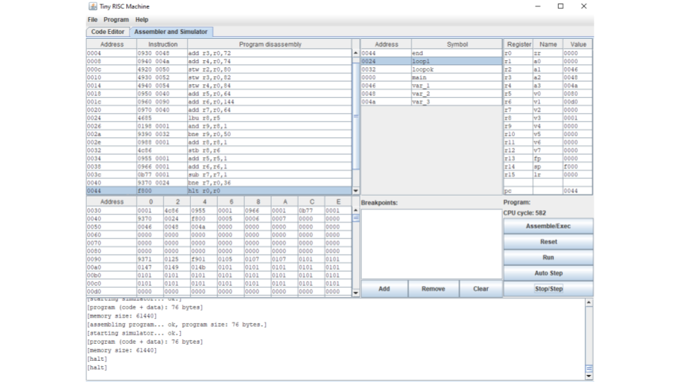

# Trabalho_T1_FSC_2025

Grupo: Matheus Cunha, Matheus Kretzmann, Nicolas Arcari e Rafael Magalhães

Linguagem de montagem e montador do processador TRM

Questão 1: 

  Escreve os N primeiros números inteiros positivos maiores que zero, armazenando-os de forma sequencial. O programa começa lendo o valor de N e inicializando os registradores v1 recebe 1, v2 é o contador de endereços e v3 o contador da quantidade de números já gerados. Dentro do loop1, o valor de v1 é gravado na memória e atualizado para o próximo número ímpar ao somar 2. O v2 também é incrementado em 2, o contador v3 aumenta em 1, sendo comparado com v0 que é o valor de N. Quando v3 atinge ou ultrapassa v0, o programa sai do loop, encerrando a execução com hlt.

  

Questão 2:

  Gera os N primeiros números da sequência de Fibonacci, armazenando-os na memória a partir do endereço 0x30. O programa começa inicializando os registradores, v0 guarda 0 e v1 guarda 1, v3 é o contador de quantos termos já foram calculados e v4 armazena o valor de N, o registrador v7 guarda o endereço na memória, começando em 0x30 e sendo incrementado de 2 em 2. A cada loop, o próximo termo da sequência é obtido pela soma dos dois anteriores (add v0,v1), armazenado na memória e então os registradores são atualizados para continuar a série. Esse processo se repete até que o v3 atinja o valor de v4, encerrando a execução com hlt.

Questão 3:

  Encontra o maior número inteiro armazenado na memória entre os endereços 0x40 e 0x80 e salva o resultado na posição 0x90. O programa começa inicializando v0 como referência para o maior valor, v2 para percorrer os endereços de memória e v3 como limite de busca (0x80). No loop, cada valor da memória é carregado em v5, se v5 for maior que v0, ele passa a ser o novo maior. Em seguida, v2 é incrementado em 2, e o processo continua até que chegue em v3. Ao final da busca, o maior valor encontrado é gravado no endereço 0x90, encerrando a execução com hlt.

Questão 4:

  O código vai navegar pela memória do 0X40 até 0X90, em um loop guarda o valor da memória na V3 e confere se é ímpar, se for ímpar ele pula pro próximo loop que guarda o valor a partir da 0X90 sempre checando se é ímpar, caso não seja soma 1 para tornar ímpar, isso se repete até a v2 ser igual a 0, pois é qusndo já navegou os 64 valores da memória.

Questão 5:

  Procura nos endereços de memória 0x60 e 0x70 dois números cuja soma seja igual a 10 e, caso encontre, salva as posições da memória desses números nos endereços 0x80 e 0x90.  O programa começa inicializando o registrador a0 guardando o endereço 0x60 e o registrador v6 que guarda o endereço 0x70. Para isso, o programa utiliza dois loops, o primeiro para percorrer o intervalo iniciando no registrador a0 até o registrador v6, e o segundo, que está dentro do primeiro, compara cada número desse intervalo, usando a1 como auxiliar. Em cada passada pelos loops, os valores lidos de memória (v0 e v1) são somados e armazenados em v2; se a soma for igual a 10, o programa salva os endereços dos dois números em 0x80 e 0x90 e encerra a execução com hlt. Se não, o a1 é incrementado até percorrer todo o intervalo, e depois o a0 também testa outras combinações.

Questão 6:

  Inverte a ordem dos valores armazenados entre os endereços de memória 0x40 e 0x60, fazendo com que eles apareçam invertidos dentro do mesmo intervalo. O programa começa carregando inicialmente os ponteiros que apontam para os blocos de texto (text1, text2, text3, text4), e em seguida percorre cada um desses vetores de caracteres em loops separados (loop, loop1, loop2, loop3). Em cada loop, os valores são lidos da memória e gravados em ordem inversa dentro dos espaços de memória 0x40 a 0x60. O código também utiliza condições de parada para verificar o fim de cada string, antes de passar para o próximo. Depois disso todos os valores aparecerão na memória em ordem invertida. 

Questão 7:

  Este código em lê os valores M e N de uma matriz em memória a partir do endereço 0x80, percorre a matriz e copia os elementos da sua diagonal principal para outro lugar da memória começando em 0x100. Ele calcula k = min(M, N) para garantir que só percorra até onde existirem elementos na diagonal, e a cada iteração avança o ponteiro de leitura em 2 bytes pulando para o próximo elemento e grava cada valor lido na posição correspondente.

Questão 8:

  Nesse código nós criamos uma variável com o nome de cada membro do grupo e guardamos os nomes na memória. Depois carregamos cada letra e printamos ela usando um loop que printa a letra que está na 0xf006, depois adiciona 1 no registrador que a variável está guardada, o loop termina quando a v0 for igual a 0, então pula para o end,  que pula uma linha no print  e guarda a palavra da v0 na 0xf006. Depois esse processo se repete 4 vezes, uma para cada nome.

Questão 9:

  Nesse código colocamos a palavra na a0 e deixamos a a1 igual a a0,para encontrar o fim da String  subimos a a1 na v0 e se encontrar um valor nulo volta uma posição para encontrar a ultima letra. No loop que vê se é palindromo, comparamos a a1, que está invertida, com a a0, que está na ordem normal, e as duas devem ser iguais. Caso sejam é palindromo, caso contrário não são.  E depois usamos outro loop para printar a palavra, que carrega cada byte e manda para a 0xf006, isso continua enquanto a v0 for igual a 0.

Questão 10:

  Primeiro iniciamos da v1 até a v5 igual a 0, para serem as contadoras. Depois guarda nos registradores o valor em ASCII de cada vogal, para poder comprar mais tarde. No primeiro loop ele vê se ainda tem caracteres para comparar, caso não tenha já guarda as contadoras na memória,  depois guarda o byte, a letra específica,  no r13, e então compara cada variável com o registrador em que as vogais foram guardadas, e caso o r13 seja igual a uma das vogais, vai adicionar 1 a contadoras daquela vogal e pula para o próximo caracter, e isso se repete até encontrar um valor nulo na memória.  E no final ele guarda a contadora de cada vogal no seu lugar de memória.

